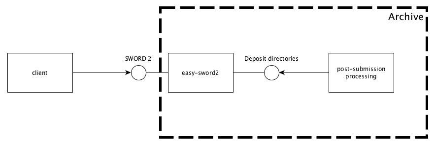

easy-sword2
============

Receive bags over a SWORD v2 session

DESCRIPTION
-----------

### Summary

Service that receives **bag**s (see [BagIt]) and stores them on disk as **deposit-dir**s. A **deposit-dir** is
a directory containing the bag and a file called `deposit.properties`, with additional information about the deposit. 
While the deposit is being received and validated it goes through several states. Once it reaches the `SUBMITTED` state 
it is made available for post-submission processing.
 
[SWORD statement]: http://swordapp.github.io/SWORDv2-Profile/SWORDProfile.html#statement

### Interfaces

`easy-sword2` can be thought of as having two interfaces:

* **SWORD**: an external facing interface which interacts with deposit clients using the [SWORD v2] protocol.
* **Deposit directories**: an internal interface, consisting of a well-defined layout and access policy for the
  directories where the deposits received over SWORD are stored. This interface is intended for use by 
  post-submission processes.

[SWORD v2]: http://swordapp.github.io/SWORDv2-Profile/SWORDProfile.html

### SWORD Interface

[SWORD v2] is a protocol for the depositing of data packages over HTTP. It builds on [Atom] and [AtomPub]. For details,
please see the linked specifications. This sections describes how `easy-sword2` implements part of the SWORD v2 protocol.
Currently the implementation is limited to:

* Retrieving the Service Document
* Creation of deposit through binary file upload
* Retrieving the SWORD statement
* One packaging format, namely BagIt

Note that in this description the [abbreviated IRI-names] from the specification are used.

[AtomPub]: https://tools.ietf.org/html/rfc5023 
[Atom]: https://tools.ietf.org/html/rfc4287
[abbreviated IRI-names]: http://swordapp.github.io/SWORDv2-Profile/SWORDProfile.html#terminology

#### Service Document

The entry point for clients of a SWORD server is the Service Document, which describes the collections and capabilities of the server.
The Service Document can be retrieved from the **SD-IRI**, which needs to be known by the client. All other URLs can be retrieved by
the client from the various responses sent by the server. For example, the Service Document contains the **Col-IRI**s (collection URLs)
that the client can use to create deposits. At present only one **Col-IRI** can be used.

#### Creating a Deposit

`easy-sword2` currently only supports the creation by [binary file deposit]. The only supported packaging is BagIt. The deposit 
may be created in one HTTP session (simple deposit) or in multiple HTTP sessions (continued deposit). See next sections for 
details.

[binary file deposit]: http://swordapp.github.io/SWORDv2-Profile/SWORDProfile.html#protocoloperations_creatingresource_binary

##### Simple Deposit

A simple deposit is created by a `POST` request to the **Col-IRI**, sending the binary package in the body of the request. The package
must be a zipped bag. The following headers must be set. 

Header                                  | Content
----------------------------------------|--------------------------------------------------------------------------------------
`Content-Type`                          | `application/zip`
`Content-Disposition`                   | `attachment; filename=<package-name>.zip` 
`Packaging`                             | `http://purl.org/net/sword/package/BagIt`
`Content-MD5`                           | the MD5 of the binary content, encoded in base-16

Of course, `<package-name>` should be replaced with an actual file name to use for the bag on the server.

`easy-sword2` will return a [deposit receipt] if the deposit was created successfully. Otherwise it will return an [error document]. 
For a successful deposit the **Edit-IRI** will be returned in the `Location` header of the HTTP response.

[deposit receipt]: http://swordapp.github.io/SWORDv2-Profile/SWORDProfile.html#depositreceipt
[error document]: http://swordapp.github.io/SWORDv2-Profile/SWORDProfile.html#errordocuments

##### Continued Deposit

A continued deposit should be used when the package is too large for a single deposit. SWORD defines a [continued deposit]
as a means to send a package in parts. The first part is sent by a `POST` request to the **Col-IRI**, the same as with a simple deposit.
Subsequent parts however are sent with a `POST` request to the **SE-IRI** (which was communicated back to the client by the deposit
receipt for the first part). For every part except the last, the header `In-Progress: false` must be included.

How to split up a large package is not specified by the SWORD protocol. `easy-sword2` requires the following:

* the package is split up by simple partioning of the zipped bag
* `Content-Type` is set to `application/octet-stream` to signal that the content is in a format bilaterally agreed by client and server
  (namely the partioning specified here).
* the order of the parts is communicated by extending the `Content-Disposition`'s `filename` field value with `.<sequence number>`,
  e.g., `filename=mypackage.zip.1`, `filename=mypackage.zip.2`, etc.
* the parts may be send out-of-order and/or in parallel, but the client must not send the last part before it has received
  the deposit receipts for all the other parts.
  
Summarizing, the following headers must be included in a continued deposit.

Header                                  | Content
----------------------------------------|--------------------------------------------------------------------------------------
`Content-Type`                          | `application/octet-stream`
`Content-Disposition`                   | `attachment; filename=<package-name>.zip.<sequence number>` 
`Packaging`                             | `http://purl.org/net/sword/package/BagIt`
`Content-MD5`                           | the MD5 of the binary content of this part, encoded in base-16
`In-Progress`                           | `true` if not the last message, `false` otherwise

[continued deposit]: http://swordapp.github.io/SWORDv2-Profile/SWORDProfile.html#continueddeposit

#### Packaging Requirements

The only packaging format supported is [BagIt]. The BagIt specifications define the following [states] for a bag: invalid, incomplete, complete and valid.
Two types of bags are accepted by `easy-sword2`:

* valid bags
* incomplete bags with a [`fetch.txt` file], provided that after fetching the files in it (and deleting `fetch.txt`) the bag becomes valid.

[BagIt]: https://tools.ietf.org/html/draft-kunze-bagit
[states]: https://tools.ietf.org/html/draft-kunze-bagit#section-3
[`fetch.txt` file]: https://tools.ietf.org/html/draft-kunze-bagit#section-2.2.3

#### Tracking a Deposit

The [deposit receipt] contains, among other things, the **Stat-IRI**. From this URL the client can obtain the [SWORD Statement] for the deposit.
The statement contains information about the state of the deposit and the objects created as a result of it (including, but not limited to, the
deposited files themselves). When being processed by `easy-sword2` the deposit goes through the following states:

State                                    | Description
-----------------------------------------|--------------------------------------------------------------------------------------
`DRAFT`                                  | Deposit is being created by the client (e.g., during a continued deposit)
`FINALIZING`                             | Deposit process has been finished by the client. Server is reassembling and validating the bag
`INVALID`                                | Deposit was reassembled but turned out not to be valid
`FAILED`                                 | Processing failed because of some unforeseen condition
`SUBMITTED`                              | Deposit was reassembled and found to be valid; it is ready for post-submission processing

If and when the deposit reaches the `SUBMITTED` state `easy-sword2` will treat it as read-only (see also next section). It will, however,
continue returning the statement to clients that request it. Post-submission workflows may extend above list of states to enable clients to
track their deposits through the workflow.

### Deposit Directories

`easy-sword2` stores incoming deposits in a designated location on a file system as **deposit-dir**s. This section describes the 
location, layout and contents of a **deposit-dir** as it goes through the stages of processing. 

#### Location and Name

***TODO: refactor to match following specs***

`easy-sword2` is configured with the following base directories for the storage of incoming data:

* `original` - in this directory `easy-sword2` will create the **deposit-dirs** for newly created deposits.
* `invalid` - here **deposit-dir**s that turn out to be invalid are moved.
* `failed` - here **deposit-dir**s that fail because of some unexpected error are moved.
* `submitted` - here valid **deposit-dir**s are move. Typically this directory will be monitored by a service that further
   processes the deposits.

The **deposit-dir**s in `invalid`, `failed` and `submitted` will be treated as read-only by `easy-sword2`. It will only attempt to 
retrieve SWORD statements from these deposits when requested by clients. Other processes may delete or modify these deposits, 
provided that their layout and contents stay conformant with the requirements stated in the next section.

By default the name of the **deposit-dir** is contructed with the following scheme: [`<user ID>` `-`] `<Unix timestamp>`. The user ID is only
used if the service is running in [LDAP mode](#ldap). The client may override the unix timestamp by sending a different name in the `Slug` header.

#### Layout and Contents

A **deposit-dir** is a directory with the following properties:

* it MUST contain at most one sub-directory
* it MUST contain a file called `deposit.properties` which is a valid Java properties file and contain the keys as specified in the 
  table below
 
Key                                      | Description
-----------------------------------------|--------------------------------------------------------------------------------------
`state.label`                            | One of the states described under Tracking a Deposit, or other states defined by a post-submission process
`state.description`                      | An extended description of the state
`depositor.userId`                       | The user ID of the depositor

***TODO: REFACTOR SO THAT ENTRY-LIST CAN BE ADDED TO THE STATEMENT***

### Authentication and Authorization

`easy-sword2` uses http basic access authentication. This method of authentication is only safe over a secure http connection.
 For requests to the **SD-IR** the credentials are not checked. For all other actions the credentials are checked and the client
 is only granted access to its own deposits.

`easy-sword2` can be configured in one of two modes: "single" or "LDAP".

#### Single User

When configured as a single user service the credentials must be configured in the application configuration file. The SHA-1 hash of the password,
salted with the user name is stored.

#### LDAP

When using LDAP authentication credentials are looked up in an LDAP directory. The following is assumed about the layout of the directory:

* the user entries all have a common parent
* the user entries must have a relative distinguished name "uid" with as the value the user ID
* the user entries must also have an attribute to indicate whether the user is authorized to use the SWORD deposit service. The name of this 
  attribute and the value that means "enabled" are configurable.
 

INSTALLATION AND CONFIGURATION
------------------------------

### Steps

1. Unzip the tarball to a directory of your choice, e.g. `/opt/
2. A new directory called `easy-sword2-<version> will be created`. This is the service's home directory.
3. Configure the service's home directory in one of two ways:
    * Set the init param `EASY_SWORD2_HOME` to point to the home directory. (In Tomcat this can be done by 
      embedding a `Parameter` element in the [context descriptor].)
    * Set the environment variable `EASY_SWORD2_HOME` to point to the home directory.
4. Fill in appropriate values for the placeholders in `$EASY_SWORD2_HOME/cfg/application.properties` (see [next subsection](#configurationparameters)).
5. Either deploy the file `$EASY_SWORD2_HOME/bin/easy-sword2.war` in the Tomcat `webapps` directory or use the 
   context descriptor `EASY_SWORD2_HOME/bin/easy-sword2.xml` and put it in `/etc/tomcat6/Catalina/localhost`.

[context descriptor]: https://tomcat.apache.org/tomcat-6.0-doc/config/context.html

### Configuration Parameters

The following parameters 

Parameter                                | Description                                                                          | Example
-----------------------------------------|--------------------------------------------------------------------------------------|-------------------------------------------------
`deposits.rootdir`                       | Directory to which to move **deposit-dir**s after unzipping and validation           | `/data/sword2-data/deposits`
`deposits.permissions`                   | The permissions to (recursively) set on a submitted **deposit-dir**                  | `rwxrwx---`
`tempdir`                                | Directory in which to  create **deposit-dir**s                                       | `/data/sword2-data/temp`
`base-url`                               | ***TODO: document this***                                                            |
`collection.iri`                         | URL of the only collection                                                           |  
`auth.mode`                              | `ldap` or `single`                                                                   | 
`auth.ldap.url`                          | URL of the LDAP directory                                                            | `ldap://localhost`                                              
`auth.ldap.users.parent-entry`           | The entry in the LDAP directory that contains all the user entries as children       | `ou=users, o=myorganization, dc=some, dc=domain`
`auth.ldap.sword-enabled-attribute-name` | The user entry attribute that indicates if the user is allowed to use SWORD          | `swordAllowed`
`auth.ldap.sword-enabled-attribute-value`| The value for above attribute that indicates permission                              | `TRUE`
`auth.single.user`                       | The user ID of the single user                                                       | `sword-client`
`auth.single.password`                   | ***TODO: document this***                                                            | 
`url-pattern`                            | A regular expression that matches all URLs that are allowed to be fetched            | `^https://my.domain.name.org/.*$`

BUILDING FROM SOURCE
--------------------

Prerequisites:

* Java 8 or higher
* Maven 3.3.3 or higher
 
Steps:

        git clone https://github.com/DANS-KNAW/easy-sword2.git
        cd easy-sword2
        mvn install

